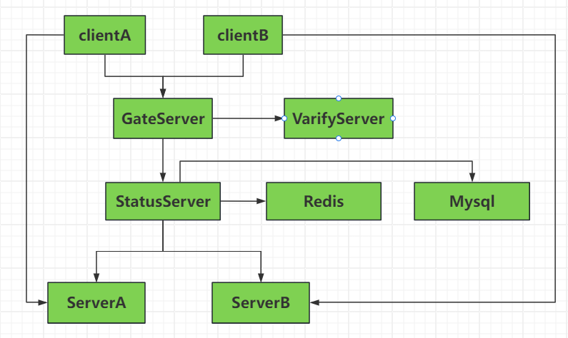

# C++全栈聊天项目实战
## 项目介绍
这是一个全栈的即时通讯项目，前端基于QT实现气泡聊天对话框，通过QListWidget实现好友列表，利用GridLayout和QPainter封装气泡聊天框组件，基于QT network模块封装http和tcp服务。支持添加好友，好友通信，聊天记录展示等功能，仿微信布局并使用qss优化界面 

后端采用分布式设计，分为GateServer网关服务，多个ChatServer聊天服务，StatusServer状态服务以及VerifyServer验证服务。 

各服务通过grpc通信，支持断线重连。GateServer网关对外采用http服务，负责处理用户登录和注册功能。登录时GateServer从StatusServer查询聊天服务达到负载均衡，ChatServer聊天服务采用asio实现tcp可靠长链接异步通信和转发, 采用多线程模式封装iocontext池提升并发性能。数据存储采用mysql服务，并基于mysqlconnector库封装连接池，同时封装redis连接池处理缓存数据，以及grpc连接池保证多服务并发访问。 

经测试单服务器支持8000连接，多服务器分布部署可支持1W~2W活跃用户。 
## 项目架构
 
**1.**GateServer为网关服务，主要应对客户端的连接和注册请求，因为服务器是是分布式，所以GateServer收到用户连接请求后会查询状态服务选择一个负载较小的Server地址给客户端，客户端拿着这个地址直接和Server通信建立长连接。 
**2.**当用户注册时会发送给GateServer,GateServer会将用户信息写入Redis缓存中GateServer调用VarifyServer验证注册的合理性并发送验证码给客户端，客户端拿着这个验证码去GateServer注册即可。 
**3.**StatusServer， ServerA， ServerB都可以直接访问Redis和Mysql服务。 
## 技术点
asio 网络库，grpc，Node.js，多线程，Redis, MySql，Qt 信号槽，网络编程，设计模式
